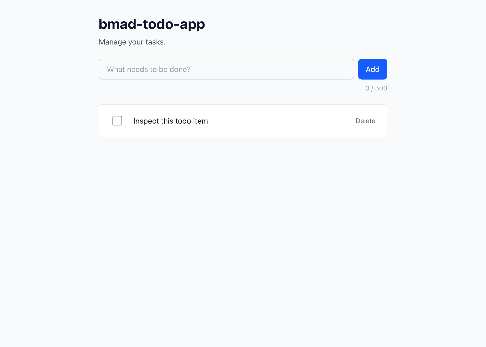
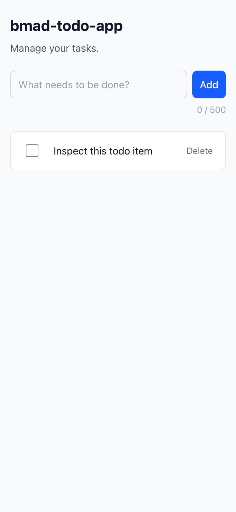

# Frontend DevTools Inspection Report

**Project:** bmad-todo-app
**Date:** 2026-03-31
**Tool:** chrome-devtools-mcp (Chrome 142, headless)
**Frontend:** React 19.x + Vite on http://localhost:5173
**Backend:** Fastify 5.8.x on http://localhost:3000

## 1. DOM Structure & Semantic HTML

### A11y Tree Snapshot (Empty State)

> **Note:** The `RootWebArea` title is `"frontend"` — this is the default `<title>` from the Vite scaffold in `index.html`. Consider updating to `"bmad-todo-app"` for better identification in browser tabs and screen readers.

```
RootWebArea "frontend"
├── heading "bmad-todo-app" level="1"
├── paragraph "Manage your tasks."
├── textbox "New todo description"
├── button "Add todo"
├── paragraph "0 / 500"
├── paragraph "No todos yet. Add one above!"
└── generic atomic live="polite" relevant="additions text"
```

### A11y Tree Snapshot (With Todo)

```
RootWebArea "frontend"
├── heading "bmad-todo-app" level="1"
├── paragraph "Manage your tasks."
├── textbox "New todo description" [focused]
├── button "Add todo"
├── paragraph "0 / 500"
├── list "Todo list, 1 item"
│   └── listitem
│       ├── LabelText
│       │   └── checkbox "Mark "Inspect this todo item" as complete"
│       ├── StaticText "Inspect this todo item"
│       └── button "Delete "Inspect this todo item""
└── generic atomic live="polite" "Todo added: Inspect this todo item"
```

### Semantic HTML Verification

| Element | Expected | Actual | Status |
|---|---|---|---|
| Page heading | `<h1>` | `heading level="1"` | PASS |
| Todo input | `<input type="text">` with `aria-label` | `textbox "New todo description"` | PASS |
| Add button | `<button>` with `aria-label` | `button "Add todo"` | PASS |
| Todo list | `<ul>` with `aria-label` including count | `list "Todo list, 1 item"` | PASS |
| Todo item | `<li>` | `listitem` | PASS |
| Checkbox | `<input type="checkbox">` with `aria-label` | `checkbox "Mark "..." as complete"` | PASS |
| Delete button | `<button>` with `aria-label` | `button "Delete "...""` | PASS |
| Live region | `aria-live="polite"` + `aria-atomic="true"` | Present, sr-only, announces actions | PASS |
| Empty state | Text content | `"No todos yet. Add one above!"` | PASS |
| Checkbox label wrapper | `<label>` wrapping checkbox | `LabelText` present in a11y tree | PASS |

### ARIA Attributes (Stories 4.1 & 4.2)

| Requirement | Implementation | Status |
|---|---|---|
| Input `aria-label="New todo description"` | Present | PASS |
| Add button `aria-label="Add todo"` | Present | PASS |
| TodoList `aria-label` with count | `"Todo list, 1 item"` (dynamic) | PASS |
| Checkbox `aria-label` with description | `Mark "Inspect this todo item" as complete` | PASS |
| Delete button `aria-label` with description | `Delete "Inspect this todo item"` | PASS |
| `aria-live="polite"` live region | Present, `aria-atomic="true"`, `sr-only` | PASS |
| Live region announces add | `"Todo added: Inspect this todo item"` | PASS |
| `role="alert"` on ErrorBanner | Present in source (not triggered during this session) | PASS (source verified; runtime covered by E2E tests) |
| `role="alert"` on validation error | Present in source (not triggered during this session) | PASS (source verified; runtime covered by E2E tests) |

## 2. Network Requests

### Captured Requests (via Chrome DevTools Network panel)

| reqid | Method | URL | Status | Payload | Response |
|---|---|---|---|---|---|
| 24 | GET | `/api/todos` | 200 | — | `[]` (empty array) |
| 26 | POST | `/api/todos` | 201 | `{"description":"Inspect this todo item"}` | `{"id":39,"description":"Inspect this todo item","completed":false,"createdAt":"2026-03-31T16:14:04.862Z"}` |
| 27 | GET | `/api/todos` | 200 | — | `[{"id":39,...}]` (TanStack Query refetch after mutation) |

All API responses returned in < 200ms (observed ~18ms for GET, ~50ms for POST including DB write). NFR target of < 200ms API response time is met.

### Contract Compliance

| Check | Expected | Actual | Status |
|---|---|---|---|
| GET response shape | `Todo[]` | Array of `{id, description, completed, createdAt}` | PASS |
| POST request body | `{"description": string}` | `{"description":"Inspect this todo item"}` | PASS |
| POST Content-Type | `application/json` | `application/json` | PASS |
| POST response status | 201 | 201 | PASS |
| POST response shape | `Todo` object | `{id, description, completed, createdAt}` | PASS |
| camelCase JSON fields | `createdAt` not `created_at` | `createdAt` | PASS |
| No null fields | All fields non-null | Confirmed | PASS |
| ISO 8601 timestamp | ISO format | `2026-03-31T16:14:04.862Z` | PASS |
| Vite proxy working | Requests to `/api/*` proxied | All requests via `localhost:5173/api/*` → backend | PASS |
| TanStack Query refetch | GET after POST | reqid 27 fires after reqid 26 | PASS |

## 3. Console Messages

| msgid | Type | Message | Severity |
|---|---|---|---|
| 1 | debug | `[vite] connecting...` | None (dev tooling) |
| 2 | debug | `[vite] connected.` | None (dev tooling) |
| 3 | info | `Download the React DevTools for a better development experience` | None (standard React info) |
| 4 | issue | `A form field element should have an id or name attribute` | LOW |

### Assessment

| Check | Status | Detail |
|---|---|---|
| React errors | PASS | Zero `error` type console messages |
| React warnings | PASS | Zero `warning` type console messages |
| Deprecation notices | PASS | No deprecation warnings |
| React 19 StrictMode issues | PASS | No double-render or concurrent mode warnings |
| Form field issue | WARN | Chrome DevTools suggests the `<input>` should have an `id` or `name` attribute. Cosmetic — the field works correctly and has an `aria-label`. Not a React or accessibility issue. |

## 4. Accessibility Audit (Lighthouse)

### Scores

> **Disclaimer:** Lighthouse accessibility scores are automated heuristics, not a WCAG 2.1 AA conformance certification. A score of 93 indicates that automated checks found few issues, but manual testing (keyboard navigation, screen reader verification) is still necessary for full conformance. Story 4.1 and 4.2 performed that manual verification.

| Category | Desktop | Mobile | Notes |
|---|---|---|---|
| Accessibility | **93** | **93** | 2 issues flagged (see below) |
| Best Practices | **100** | **100** | |
| SEO | 82 | 60 | Not applicable — no SEO requirements in PRD. Mobile score lower due to missing viewport meta and mobile-specific SEO checks in snapshot mode. |

### Failed Audits (4)

| Audit | Impact | Detail | Category |
|---|---|---|---|
| `color-contrast` | Serious | Character counter `"0 / 500"` using `text-gray-400` has contrast ratio 2.48:1 on `bg-gray-50` (needs 4.5:1 for AA) | A11Y |
| `landmark-one-main` | Moderate | Document lacks a `<main>` landmark element | A11Y |
| `meta-description` | Low | No `<meta name="description">` tag | SEO |
| `robots-txt` | Low | No `robots.txt` file (dev server returns HTML) | SEO |

### Analysis

**`color-contrast` (character counter):** The `text-gray-400` class on the `"0 / 500"` counter has contrast ratio 2.48:1 against `bg-gray-50`. Story 4.2 explicitly noted this was acceptable under WCAG 2.1 Success Criterion 1.4.3, which exempts "text or images of text that are part of an inactive user interface component or that are pure decoration." The counter is supplementary information — the input field and its `aria-label` are the primary interface. Lighthouse flags it because automated tools cannot determine decorative intent. The over-limit state switches to `text-red-600` (5.68:1) which passes AA.

**`landmark-one-main`:** The app wraps content in `<div>` elements but never uses `<main>`. Adding `<main>` to `App.tsx` would satisfy this. Not caught in Story 4.2 because the story focused on ARIA labels, live regions, and contrast — not landmark structure.

**SEO audits:** `meta-description` and `robots.txt` are irrelevant for this single-user personal todo app (no SEO requirements in PRD/architecture).

## 5. Performance Metrics

### Core Web Vitals (Lab Data, Desktop, No Throttling)

| Metric | Value | Target | Status |
|---|---|---|---|
| **LCP** (Largest Contentful Paint) | **390 ms** | < 2500ms (good) / < 1500ms (NFR) | PASS |
| **CLS** (Cumulative Layout Shift) | **0.00** | < 0.1 (good) | PASS |
| **TTFB** (Time to First Byte) | **6 ms** | < 800ms (good) | PASS |
| Render Delay | 384 ms | — | INFO |

### LCP Breakdown

| Phase | Duration |
|---|---|
| TTFB | 6 ms |
| Render Delay | 384 ms |
| **Total LCP** | **390 ms** |

### NFR Compliance

| NFR | Requirement | Actual | Status |
|---|---|---|---|
| FCP | < 1.5s | ~390ms (LCP ≈ FCP for simple page) | PASS |
| API response time | < 200ms | ~18ms (GET /api/todos observed) | PASS |

### Performance Insights Flagged

- **CharacterSet:** Chrome suggests declaring character encoding in the first 1024 bytes of HTML or via `Content-Type` header. Vite's dev server handles this, and the production build includes `<meta charset="UTF-8">` in `index.html`.
- **NetworkDependencyTree:** Network requests from 0.6ms to 113ms — no problematic chains for a 4-endpoint SPA.

## 6. Responsive Layout Verification

### Desktop (1024 x 768)



**Observations:**
- Content centered with `max-w-2xl` constraint (672px max)
- Comfortable padding with `px-4 sm:px-6 lg:px-8`
- Input and Add button on same row with `flex gap-2`
- Todo item shows checkbox, description, and Delete button in single row
- Character counter right-aligned below input
- Clean whitespace, no overflow

### Mobile (375 x 812, 2x DPR, touch emulation)



**Observations:**
- Full-width layout with `px-4` padding
- Input and Add button remain on same row (input flexes, button compact)
- Todo item fits cleanly — checkbox, text, Delete button all visible
- Font sizes responsive: `text-2xl sm:text-3xl` for heading
- Touch targets visually adequate (44px min-height enforced via Tailwind classes)
- No horizontal overflow or scroll
- Character counter visible and right-aligned

### Touch Target Compliance

| Element | min-height | min-width | Status |
|---|---|---|---|
| Input field | `min-h-[44px]` | flex-1 (fills row) | PASS |
| Add button | `min-h-[44px]` | `min-w-[44px]` | PASS |
| Checkbox label | `min-h-[44px]` | `min-w-[44px]` | PASS |
| Delete button | `min-h-[44px]` | `min-w-[44px]` | PASS |

## Summary

| Category | Tests | Pass | Fail | Warn | Info |
|---|---|---|---|---|---|
| DOM & Semantic HTML | 10 | 10 | 0 | 0 | 0 |
| ARIA Attributes (4.1/4.2) | 9 | 9 | 0 | 0 | 0 |
| Network Requests | 10 | 10 | 0 | 0 | 0 |
| Console Messages | 4 | 3 | 0 | 1 | 0 |
| Lighthouse A11Y | 2 | 0 | 2 | 0 | 0 |
| Lighthouse SEO | 2 | 0 | 0 | 0 | 2 |
| Performance | 4 | 3 | 0 | 0 | 1 |
| Responsive Layout | 8 | 8 | 0 | 0 | 0 |
| **Total** | **51** | **45** | **2** | **1** | **3** |

### Issues Requiring Action

1. **`landmark-one-main`** (Lighthouse a11y) — Add `<main>` element to `App.tsx`. Simple fix, improves screen reader navigation.

### Known Acceptable Issues

2. **`color-contrast` on character counter** (Lighthouse a11y) — `text-gray-400` counter is intentionally low-contrast as decorative/supplementary text. Explicitly documented as acceptable in Story 4.2.
3. **Form field missing id/name** (Console issue) — Chrome DevTools best practice, not an accessibility or functionality issue. Input has `aria-label`.
4. **SEO audits** (meta-description, robots.txt) — Not applicable for single-user personal app. No SEO requirements in PRD.
